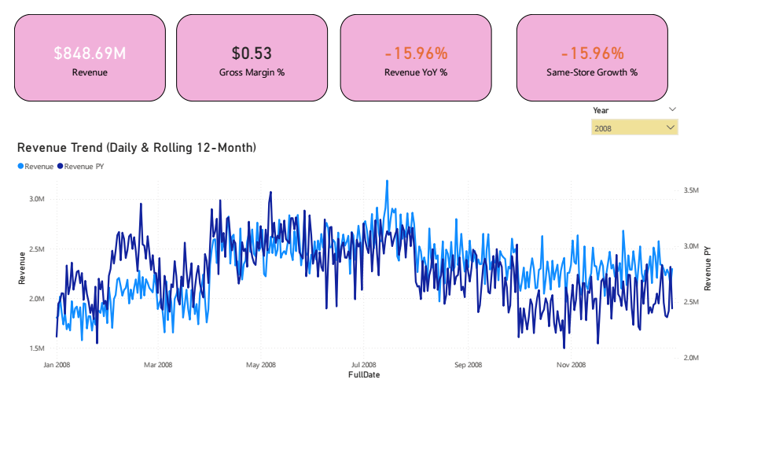
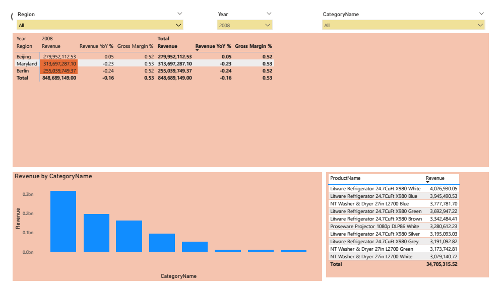
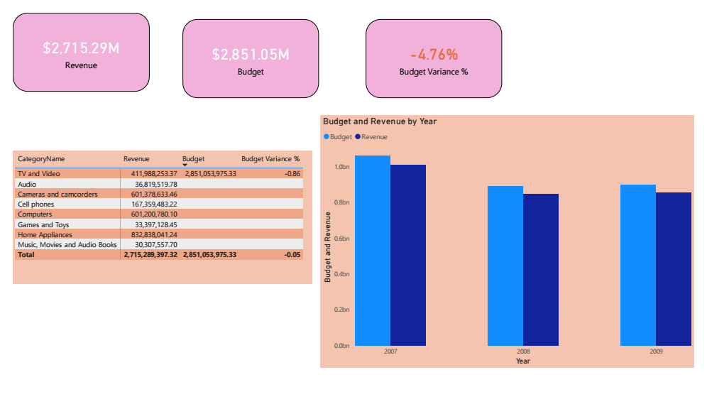

# Executive Revenue Intelligence Dashboard

A full-stack BI portfolio project: SQL Server data warehouse design → Power BI executive reporting suite, built on Microsoft's Contoso retail sample dataset.







## Stack

- **SQL Server** — star schema design, indexing, stored procedures
- **Power BI** — data model, DAX time intelligence, 3-page executive report

## Project structure

```
contoso-exec-dashboard/
├── sql/
│   ├── 01_schema.sql              # Star schema DDL
│   ├── 02_indexes.sql             # Indexing strategy + before/after query notes
│   └── 03_stored_procedures.sql   # YoY revenue & same-store growth procs
├── docs/
│   ├── data_model.md              # ER diagram + ETL notes
│   ├── dax_measures.md            # Full DAX measure reference
│   ├── case_study.md              # Problem / Approach / Result write-up
│   └── screenshots/               # Report page screenshots
└── pbix/
    └── ContosoExecDashboard.pbix  # Full Power BI report
```

## Setup

1. Download the [Contoso Retail DW sample](https://www.microsoft.com/en-us/download/details.aspx?id=18279)
2. Run `sql/01_schema.sql` to create the database and star schema
3. Load the Contoso data into the schema (see `docs/data_model.md` for ETL notes)
4. Run `sql/02_indexes.sql` and `sql/03_stored_procedures.sql`
5. Run `sql/05_load_facts_batched.sql` to load the fact table (batched to avoid transaction log issues on large loads)
6. Run `sql/07_generate_synthetic_budget.sql` to populate budget data for the Forecast page
7. Open Power BI Desktop → Get Data → SQL Server → connect to `ContosoExecBI`
8. Import the DAX measures from `docs/dax_measures.md`
9. Build the 3 report pages (Exec Summary, Drill-down, Forecast) — see `docs/case_study.md` for the narrative framing

## Author

Ifeanyi Asangwor — Power BI & SQL Server Consultant
[Contra](https://contra.com/ifeanyi_asangwor_upz2uzt7)
