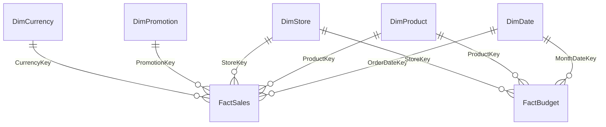

# Data Model

## Source

[Contoso Retail Data Warehouse](https://www.microsoft.com/en-us/download/details.aspx?id=18279) sample dataset, reshaped from Microsoft's original normalized schema into a clean reporting star schema.

## Why a star schema (not the raw Contoso normalized tables)

The raw Contoso DW ships fairly normalized. For a Power BI model, a star schema:

- Simplifies relationships to single-direction, one-to-many — avoids ambiguous filter paths and circular relationship errors
- Lets DAX time intelligence work correctly (requires one clean date dimension, not multiple date columns scattered across tables)
- Improves query performance — fewer joins at query time, more work done once at ETL time

## Entity-relationship overview

## Grain

- `FactSales`: one row per order line (product × store × date × promotion)
- `FactBudget`: one row per product × store × month

## ETL notes

1. Source data loaded into staging tables matching the original Contoso schema.
2. Surrogate keys mapped 1:1 from source (Contoso already uses integer keys — no key generation needed).
3. `DimDate` generated via a standard date-dimension script (2015–2026), with fiscal year starting July 1 — update `FiscalQuarter`/`FiscalYear` logic in `01_schema.sql` if your target client's fiscal year differs.
4. `FactSales.SalesAmount` and `CostAmount` are computed columns (`PERSISTED`), not calculated in Power BI — keeps the model lighter and the logic auditable at the SQL layer.
